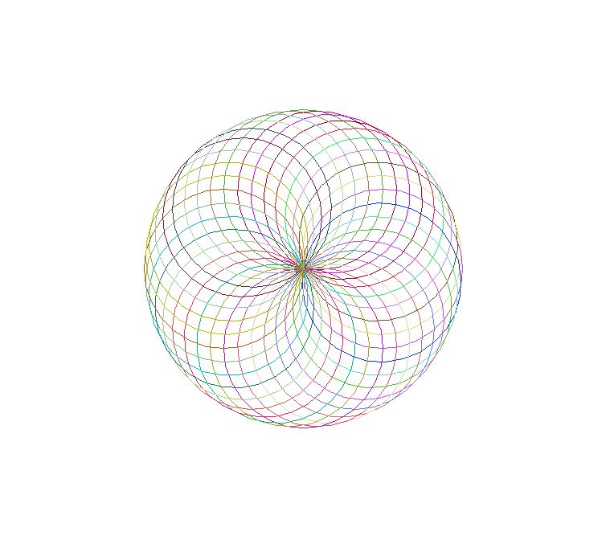

This Python code uses the turtle graphics library to draw a colorful spirograph by repeatedly rotating a circle by a fixed angle. The turtle changes its heading slightly after drawing each circle, creating a circular, symmetric pattern. Random colors are assigned to each circle for a vibrant visual effect.

